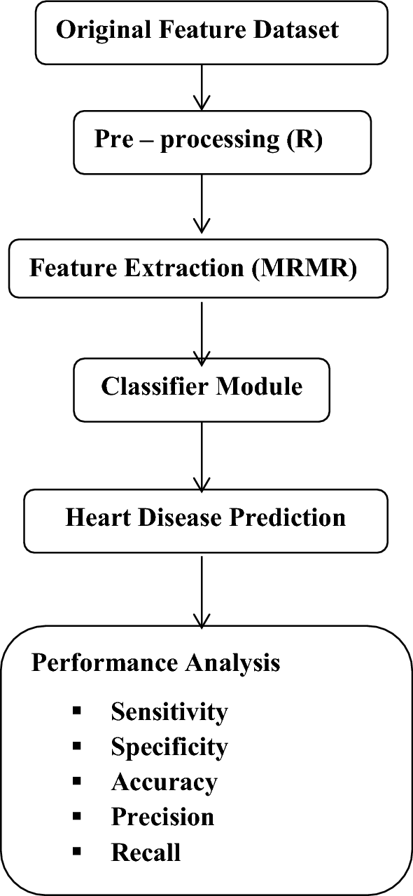

# Heart Failure Prediction Project

## Brief 
This project aims to predict heart failure based on various clinical and demographic factors. The dataset used is from the MIMIC-III database, which is a large, publicly available database of de-identified datasets


Cardiovascular diseases are the most common cause of deaths globally, taking an estimated 17.9 million lives each year, which accounts for 31% of all deaths worldwide. Heart failure is a common event caused by Cardiovascular diseases. It is characterized by the heart’s inability to pump an adequate supply of blood to the body. Without sufficient blood flow, all major body functions are disrupted. Heart failure is a condition or a collection of symptoms that weaken the heart.


## Project Description

This project aims to predict the likelihood of death events in patients with heart failure using machine learning techniques. It utilizes a neural network model implemented with Keras to analyze clinical data and provide predictions.




## Project Structure

```
Heart_Failure_Prediction/
|
|
│── README.md
│── notebook/
│   └── notebook.ipynb
│── src/
│   ├── preprocessing.py
│   ├── model.py
│   └── prediction.py
│── data/
│   ├── train/
│   └── test/
└── models/
    ├── scaler.pkl
    └── heart_failure_model.h5
    
```

## Setup Instructions

1. Ensure you have Python 3.7+ installed.
2. Clone this repository:
   ```
   git clone https://github.com/jefftrojan/heart-failure-prediction.git
   cd heart-failure-prediction
   ```
3. Install required libraries:
   ```
   pip install -r requirements.txt
   ```


## Preprocessing Steps

The `src/preprocessing.py` file contains the following main functions:

1. `load_and_preprocess_data(file_path)`: Loads the CSV file, splits features and target, scales the features using StandardScaler, and saves the scaler.
2. `load_scaler()`: Loads the saved StandardScaler object.

To run preprocessing:
```
python src/preprocessing.py
```

## Model Training

The `src/model.py` file contains the following main functions:

1. `create_model()`: Creates and compiles the neural network model.
2. `train_model(X_train, y_train, epochs=500, batch_size=32)`: Trains the model with early stopping.
3. `evaluate_model(model, X_test, y_test)`: Evaluates the trained model on test data.
4. `plot_training_history(history)`: Plots the training and validation accuracy/loss.

To train the model:
```
python src/model.py
```

## Model Testing and Prediction

The `src/prediction.py` file contains the following main functions:

1. `load_trained_model(model_path)`: Loads the trained model from a file.
2. `predict(model, new_data)`: Makes predictions using the trained model.

To run predictions:
```
python src/prediction.py
```

## Model Files

1. Pickle (.pkl) file: 
   - Location: `models/scaler.pkl`
   - Purpose: Stores the fitted StandardScaler object for feature scaling.

2. TensorFlow (.h5) file:
   - Location: `models/heart_failure_model.h5`
   - Purpose: Stores the trained Keras model.

## Notebook

The Jupyter notebook `notebook/notebook.ipynb` provides an interactive environment for data analysis, model training, and result visualization. To use the notebook:

1. Ensure you have Jupyter installed: `pip install jupyter`
2. Navigate to the project directory and start Jupyter:
   ```
   jupyter notebook
   ```
3. Open `notebook/project_name.ipynb` from the Jupyter interface.

The notebook includes cells for:
- Data loading and exploration
- Preprocessing steps
- Model creation and training
- Evaluation and visualization of results

## Using the Model

To use the trained model for predictions:

1. Ensure your new data is in the same format as the training data.
2. Use the `predict` function in `src/prediction.py`:

```python
from src.prediction import load_trained_model, predict
import pandas as pd

model = load_trained_model()
new_data = pd.DataFrame({...})  
predictions = predict(model, new_data)
```


## Deployment link

  The model is deployed on Render. You can access it here: [https://heart-failure-prediction-ktzo.onrender.com/docs]

## Demo video
Link - > [https://www.loom.com/share/eb587df444e04358bf969ce76e8bfda1?sid=cb5c4119-c84d-435a-9394-d0245657562b]


## Load testing to simulate a large number of requests

 Run the command 
```bash
locust -f locustfile.py --host=http://127.0.0.1:8000

```


## Additional Notes

- The model and preprocessing steps can be fine-tuned by adjusting parameters in the respective Python files.
- For large datasets, consider using data generators and training the model in batches.
- Regularly update the `requirements.txt` file if you add new dependencies to the project.

